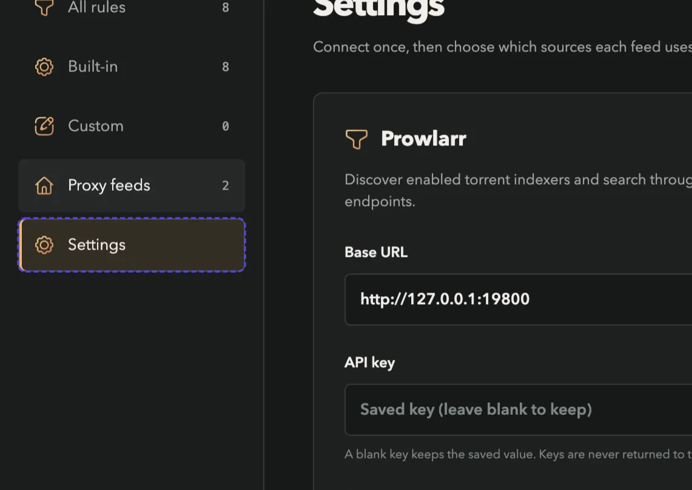
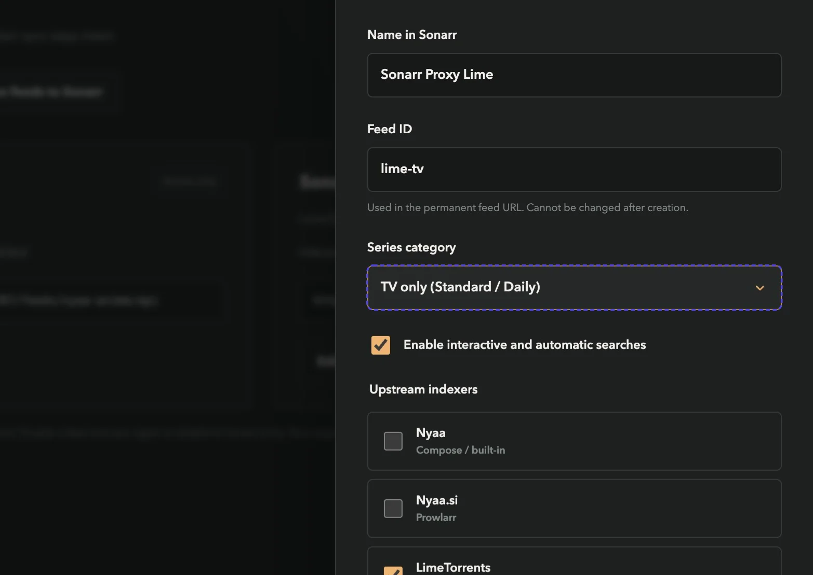
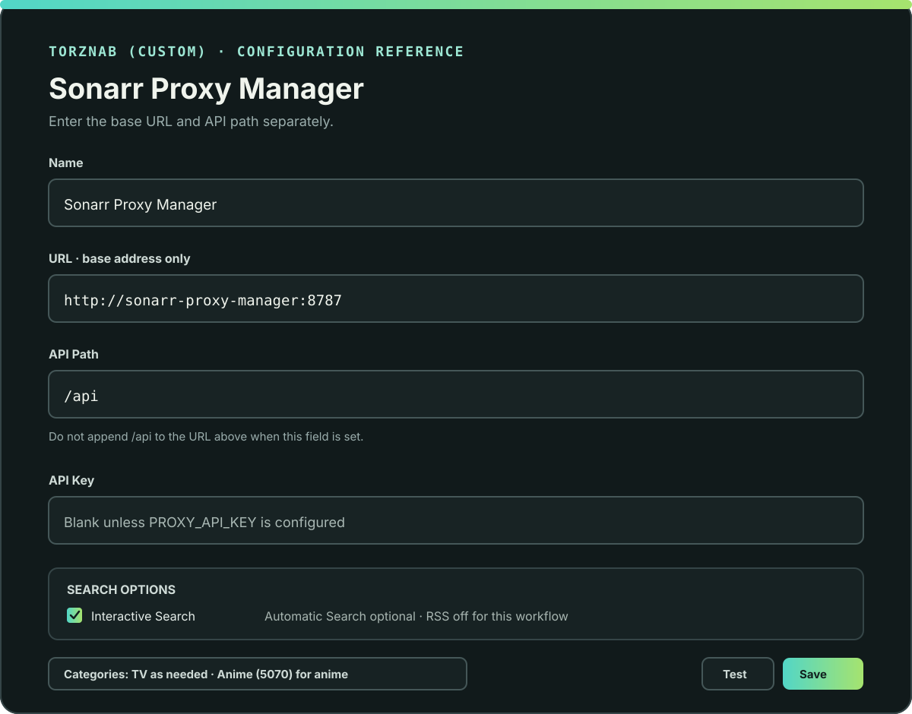
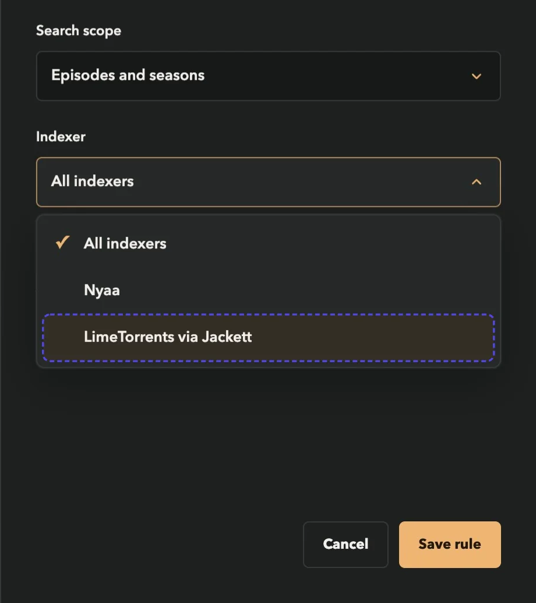
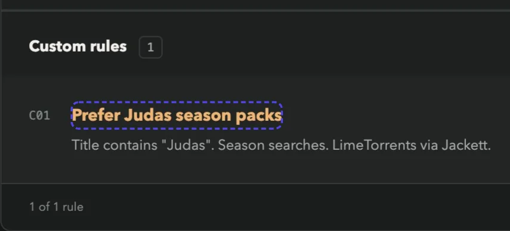

# Sonarr Proxy Manager

[Project guide / wiki](https://deepdaddyttv.github.io/Sonarr-Proxy-Manager/) · [Buy Me a Coffee](https://buymeacoffee.com/deepdaddyttv)

Sonarr Proxy Manager is a Dockerized Torznab proxy for Sonarr. Connect Prowlarr with its API key, select upstream indexers, and publish separate Anime or TV feeds with independent rules. Your existing Prowlarr-to-Sonarr connection keeps working normally. Nyaa is also available directly, and additional Torznab sources can be configured in Compose.

## What It Does

Each virtual feed has its own endpoint, such as `/feeds/nyaa-anime/api` or `/feeds/lime-tv/api`. A request searches only that feed's selected upstreams and applies only its rule profile. Episode searches exclude packs; season searches exclude single episodes and partial ranges. Anime profiles retain expanded queries, title normalization, and Japanese/English Dual Audio annotation. New TV profiles leave titles and audio languages unchanged by default while retaining exact-series and episode/season filtering, including dated Daily-series episodes.

The browser manager is served at `/manager/`, with a **Settings** tab for API connections, **Proxy feeds** for virtual indexers, and a **Rule profile** picker for independent built-in/custom rules. Built-ins start locked; click the lock icon to unlock editing. Custom rules can prefer, exclude, rewrite, or annotate titles for one upstream or every upstream in their profile. The original combined `/api` endpoint and its rules remain available for backward compatibility; discovered Prowlarr sources are not automatically added to that legacy endpoint.

## Requirements

- Sonarr configured with a Torznab indexer.
- Docker Engine or another OCI-compatible container runtime.
- Outbound HTTPS access from the container to Nyaa.si and any configured upstream indexers.
- Network reachability between Sonarr, the proxy, and any configured Prowlarr/Torznab upstreams. A shared Docker network is one option; native Arr installs can use reachable host ports.
- A persistent `/data` volume.
- `AUTH_USERNAME` and `AUTH_PASSWORD` for the browser manager.
- A torrent download client already configured in Sonarr. This proxy finds and describes releases; Sonarr and its download client handle downloads.

No host Python installation or Nyaa account is required. Optional Sonarr URL and API key settings enable series metadata lookup when requests identify a series by TVDB or IMDb ID.

## Quick Start

Each successful main-branch build publishes three image tags: `dev` and `latest` both point to the newest build, while `build-<number>` pins one build. Use `latest` for normal installs, keep a personal testing stack on `dev`, or replace `<number>` with a GitHub Actions build number to pin an exact build without looking up a commit SHA.

Create a Docker network shared with Sonarr if you do not already have one:

```sh
docker network create sonarr-net
```

Attach the Sonarr container to that network, then save this as `compose.yaml`:

```yaml
services:
  sonarr-proxy-manager:
    image: ghcr.io/deepdaddyttv/sonarr-proxy-manager:latest
    restart: unless-stopped
    ports:
      - "127.0.0.1:8787:8787"
    environment:
      SONARR_URL: ${SONARR_URL:-}
      SONARR_API_KEY: ${SONARR_API_KEY:-}
      PROWLARR_URL: ${PROWLARR_URL:-}
      PROWLARR_API_KEY: ${PROWLARR_API_KEY:-}
      PROXY_PUBLIC_URL: ${PROXY_PUBLIC_URL:-}
      PROXY_API_KEY: ${PROXY_API_KEY:-}
      PROWLARR_DISCOVER_ON_START: ${PROWLARR_DISCOVER_ON_START:-false}
      UPSTREAM_INDEXERS_JSON: "${UPSTREAM_INDEXERS_JSON:-[]}"
      AUTH_USERNAME: ${AUTH_USERNAME:?Set AUTH_USERNAME}
      AUTH_PASSWORD: ${AUTH_PASSWORD:?Set AUTH_PASSWORD}
      AUTH_COOKIE_SECURE: ${AUTH_COOKIE_SECURE:-false}
    volumes:
      - sonarr-proxy-manager-data:/data
    networks:
      - sonarr-net

volumes:
  sonarr-proxy-manager-data:

networks:
  sonarr-net:
    external: true
```

Create an untracked `.env` file beside the Compose file:

```dotenv
AUTH_USERNAME=proxy-admin
AUTH_PASSWORD=replace-with-a-long-unique-password
AUTH_COOKIE_SECURE=false
PROXY_API_KEY=
PROXY_PUBLIC_URL=http://sonarr-proxy-manager:8787
SONARR_URL=
SONARR_API_KEY=
PROWLARR_URL=
PROWLARR_API_KEY=
PROWLARR_DISCOVER_ON_START=false
UPSTREAM_INDEXERS_JSON='[{"id":"prowlarr-anime","name":"Prowlarr Anime","url":"http://prowlarr:9696/1/api","api_key":"replace-with-prowlarr-api-key","categories":["5000","5070"]}]'
```

Nyaa is always available as the built-in source. The optional JSON array adds Torznab-compatible upstreams; use the API URL and key shown by that indexer (for example, copy the Torznab URL from Prowlarr and make sure its hostname is reachable on the proxy's Docker network). `id` must be unique and use letters, numbers, `_` or `-`; `name` is shown in the rule editor. `categories` is optional and limits the upstream query to Torznab category IDs. After changing the Compose environment, recreate the container; the configured names then appear in the custom-rule Indexer selector. Indexer credentials remain server-side and are never returned by the manager API. They are present in the container environment, so keep the Compose file and `.env` private.

Start the service with `docker compose up -d`. The manager is available locally at `http://127.0.0.1:8787/manager/`. Do not expose the manager publicly. If you put it behind HTTPS, set `AUTH_COOKIE_SECURE=true` and use a private, access-controlled route.

### Connect Prowlarr and Sonarr in the Manager

1. Open **Settings**. Enter the Prowlarr base URL and API key from Prowlarr's **Settings / General**.
2. Enter the Sonarr base URL and API key from Sonarr's **Settings / General**. This key is used for registration and series metadata lookup, not downloads.
3. Enter the **Proxy base URL** reachable from Sonarr, for example `http://sonarr-proxy-manager:8787` on a shared network. It is a network address, not an instruction to expose the manager publicly.
4. Save settings, then test the saved connections. Empty API-key inputs preserve saved keys. Nonempty environment values take precedence and are read-only in the UI.
5. Open **Proxy feeds** and select **Discover Prowlarr indexers**. Discovery imports enabled searchable torrent indexers; it excludes this manager's feeds and legacy Nyaa Season Proxy entries to avoid recursive requests. No Prowlarr indexer or application is modified.
6. Add `Sonarr Proxy Nyaa`, select **Anime only**, and select the discovered Nyaa source. Add `Sonarr Proxy Lime`, select **TV only**, and select LimeTorrents. One feed can select several upstreams if they should share a rule profile.
7. Use **Edit rules** on each feed. Built-in anime settings are cloned once from your existing configuration. New TV/both profiles start with anime normalization, query expansion, year stripping, and Japanese/English annotation disabled. Unlock a built-in before changing its enabled state.
8. Select **Sync feeds to Sonarr**. Registration creates or updates only entries owned by this manager. It is explicit, not automatic: startup never writes Sonarr indexers. Repeated syncs update the same entries rather than creating duplicates. Disable a feed and sync again to disable its Sonarr entry; no indexers are deleted.

<figure>
  
  <figcaption>Settings keeps API keys server-side. This Mimik capture uses a local documentation demo, not a live installation.</figcaption>
</figure>

<figure>
  
  <figcaption>Give each feed its own Sonarr name, series category, and upstream selection. LimeTorrents is selected for this TV-only example; Nyaa is not.</figcaption>
</figure>

| Virtual indexer | Regular Categories in Sonarr | Anime Categories in Sonarr |
| --- | --- | --- |
| Sonarr Proxy Nyaa / Anime only | Empty | `5070` |
| Sonarr Proxy Lime / TV only | Specific TV subcategories, excluding `5000` and `5070` | Empty |
| Anime and TV | Specific TV subcategories | `5070` |

By default, Sonarr uses the show's **Series Type** to choose the category field; it does not infer anime from the indexer name. The broad parent category **TV (`5000`) includes Anime (`5070`)**, so the manager does not use `5000` in the registered standard-search field. A tracker exposing only parent TV can still be queried upstream through `5000`; the virtual feed's request routing remains separate and explicitly categorized anime items are excluded from its TV path.

### Keep Standard Numbering and Route by Tags

If you organize anime with Sonarr tags and deliberately keep **Series Type = Standard**, open **Settings / Series routing**. Enter your existing Anime and TV tag labels (for example `anime` and `tv`), save, and sync feeds again. The manager resolves the existing tag IDs and restricts its own Sonarr entries to the appropriate tags. The Anime feed also gets regular category `5070`, so Standard-numbered anime searches reach it. Its Anime Categories remain `5070`; the TV feed still excludes that category.

The proxy additionally checks the requested series' tags before contacting its upstreams, using Sonarr identifiers or an exact normalized main/alternate title. An anime-tagged series cannot use the TV feed even if it also has the TV tag. Unknown or ambiguously classified titles are rejected in tag mode. Category-only requests without a show name or identifier are allowed for Sonarr's save-time indexer test; RSS stays disabled. With a TV tag configured, untagged shows do not use the TV feed. If only an Anime tag is configured, the TV feed accepts known shows without that Anime tag. Tag and series metadata are cached for up to five minutes. Neither series types, existing series tags, episode ordering, nor the original Prowlarr entries are changed. Leave both labels empty and sync again to restore Series Type routing.

Compose equivalent:

```yaml
environment:
  SONARR_ANIME_TAG: anime
  SONARR_TV_TAG: tv
```

Existing raw Prowlarr entries continue returning their original results; a release can appear once raw and once rewritten. The manager never edits their categories. For strict separation across those raw entries too, configure Prowlarr's Sonarr application **Sync Categories / Anime Sync Categories** appropriately. Avoid manually editing Prowlarr-owned Sonarr fields when using Full Sync, which can overwrite those edits. Existing legacy proxy entries also remain unchanged; disable them yourself when you no longer want combined-feed results. See [Prowlarr application sync](https://wiki.servarr.com/en/prowlarr/quick-start-guide) and [Sonarr indexer settings](https://wiki.servarr.com/sonarr/settings#indexers).

### Configure Connections and Feeds in Compose

Instead of entering connections in Settings, set these environment variables on the same Compose service. Keep their values in an untracked `.env`; the names below are placeholders, not real keys:

```yaml
environment:
  PROWLARR_URL: ${PROWLARR_URL:?Set PROWLARR_URL}
  PROWLARR_API_KEY: ${PROWLARR_API_KEY:?Set PROWLARR_API_KEY}
  SONARR_URL: ${SONARR_URL:?Set SONARR_URL}
  SONARR_API_KEY: ${SONARR_API_KEY:?Set SONARR_API_KEY}
  PROXY_PUBLIC_URL: http://sonarr-proxy-manager:8787
  PROXY_API_KEY: ${PROXY_API_KEY:?Set a separate proxy key}
  PROWLARR_DISCOVER_ON_START: "true"
  PROXY_FEEDS_JSON: >-
    [{"id":"nyaa-anime","name":"Sonarr Proxy Nyaa","mode":"anime","sourceIds":["prowlarr-2"]},
     {"id":"lime-tv","name":"Sonarr Proxy Lime","mode":"tv","sourceIds":["prowlarr-22"]}]
```

Replace `2` and `22` with your own Prowlarr indexer IDs. They are local IDs, not universal tracker identifiers. `PROXY_FEEDS_JSON` makes feed definitions read-only in the UI; rules remain editable. Remove it if you want to manage feed definitions in the UI. Environment-declared feeds trigger startup discovery by default unless `PROWLARR_DISCOVER_ON_START=false` is explicitly set. If Prowlarr is unavailable, the app starts and retains an existing discovery snapshot; retry discovery when it is available.

For a completely manual Sonarr setup, add one custom Torznab entry per feed. Use the proxy base URL, **API Path** `/feeds/<feed-id>/api`, and the proxy feed key. New feed endpoints always require a key; if none was supplied, a persistent one is generated and sent directly by **Sync feeds to Sonarr**. To enter it manually, first set a known key in Settings or `PROXY_API_KEY`. Keep RSS disabled. Use the two category fields from the table above.

### Connect the Legacy Combined Feed to Sonarr

Add the proxy once as a custom Torznab indexer in Sonarr. Upstream indexers are searched behind this single endpoint:

1. Open **Settings → Indexers → Add (+) → Torrent → Torznab → Custom**.
2. Set the name to `Sonarr Proxy Manager`.
3. Set **URL** (the base URL) to `http://sonarr-proxy-manager:8787` and **API Path** to `/api`. Use a host and port reachable from Sonarr if it is not on the shared Docker network. Do not put `/api` in both fields.
4. Leave **API Key** empty unless `PROXY_API_KEY` is set; if it is set, enter that exact value.
5. Enable **Interactive Search**. Enable **Automatic Search** if you want Sonarr's targeted searches to use the proxy. Leave **RSS** disabled for the intended interactive episode/season workflow; this proxy is not a weekly episode feed.
6. Select the TV categories you need. For anime, include **Anime (5070)** in **Anime Categories** if Sonarr shows that separate field. Sonarr can populate the available categories after the first successful **Test**.
7. Use **Test**, then **Save**. Make sure Sonarr already has a torrent download client configured; Sonarr and that client handle the download.

<figure>
  
  <figcaption>Configuration reference, not a live Sonarr screenshot. Sonarr's layout can vary by version; the values and field separation are the important part.</figcaption>
</figure>

| Setting | Value |
| --- | --- |
| Name | `Sonarr Proxy Manager` |
| URL (base) | `http://sonarr-proxy-manager:8787` |
| API Path | `/api` |
| API key | Leave blank unless `PROXY_API_KEY` is set; otherwise enter that value. |
| Search options | Interactive Search on; Automatic Search optional; RSS off for this use case. |
| Categories | Select needed TV categories; include Anime (`5070`) in Anime Categories for anime series when that field is shown. |

The proxy advertises standard TV categories as well as Anime. Nyaa remains restricted to its configured category (`1_2` by default); other upstreams can use their own Torznab category IDs in `UPSTREAM_INDEXERS_JSON`. Sonarr and the proxy must share `sonarr-net` for the container hostname above to resolve; `localhost` inside Sonarr points back to the Sonarr container, not this proxy. Manager login credentials and `PROXY_API_KEY` are separate: the former protects the browser UI, while the latter optionally protects Torznab requests. See the [Sonarr indexer settings guide](https://wiki.servarr.com/sonarr/settings#indexers) for the current field names and controls.

### Add More Indexers

Use `UPSTREAM_INDEXERS_JSON` to add any upstream that exposes a Torznab API, including individual Prowlarr or Jackett indexer endpoints. This is not a raw-site scraper for arbitrary API formats; the upstream must accept standard Torznab `tvsearch` requests. Example with two sources:

```json
[
  {
    "id": "prowlarr-anime",
    "name": "Prowlarr Anime",
    "url": "http://prowlarr:9696/1/api",
    "api_key": "YOUR_PROWLARR_API_KEY",
    "categories": ["5000", "5070"]
  },
  {
    "id": "jackett-tv",
    "name": "Jackett TV",
    "url": "http://jackett:9117/api/v2.0/indexers/example/results/torznab/api",
    "api_key": "YOUR_JACKETT_API_KEY",
    "categories": ["5000"]
  }
]
```

Each source must be reachable from the proxy container. After recreating the proxy with the updated JSON, choose **All indexers** or a specific source when creating or editing a custom rule. Existing rules migrate to **All indexers** automatically. For example, an exclude rule matching `Judas` can be limited to `Prowlarr Anime` without affecting a Judas release returned by Nyaa or another source.

### Example: Add LimeTorrents Through Jackett

LimeTorrents is a tracker, not a Torznab API endpoint. Add it in Jackett or Prowlarr first, then copy that tool's Torznab feed URL and use its API key in the proxy's private Compose environment. A Jackett-style entry looks like this; the exact tracker ID and URL base depend on your installation, so prefer the **Copy Torznab Feed** URL shown by Jackett:

```json
[
  {
    "id": "limetorrents-jackett",
    "name": "LimeTorrents via Jackett",
    "url": "http://jackett:9117/api/v2.0/indexers/limetorrents/results/torznab/api",
    "api_key": "YOUR_JACKETT_API_KEY"
  }
]
```

The proxy must be able to reach `jackett:9117` on its Docker network. Keep the real API key out of public Compose examples and source control. See [Jackett's Torznab API format](https://github.com/Jackett/Jackett#api-usage) if you need to identify the copied feed URL.

## Built-In Rules

These eight built-ins start locked. They are enabled by default for the legacy/anime profiles; the four anime-specific transformations described above start disabled for new TV/both profiles. Unlocking a rule permits changing its manager settings, not redefining its algorithm.

| Rule | Default behavior |
| --- | --- |
| Strip release years | Removes bracketed years before classification so a year such as `[2024]` is not mistaken for an episode number. |
| Normalize season packs | Recognizes `Season 1`, `S01`, and ordinal season forms, then rewrites accepted season titles to Sonarr-safe `Sxx` form. |
| Episode scans stay episodic | For a request with both `season` and `ep`, keeps only the exact matching `SxxExx`; season packs and episode ranges are excluded. |
| Season scans stay seasonal | For a request with `season` but no `ep`, excludes single episodes and partial ranges while keeping matching season packs. |
| Anchor the series match | Requires meaningful query words to match the release title, reducing accidental substring matches for a different series. |
| Expand release queries | Tries padded, unpadded, ordinal, and year-aware season/episode query forms to find more release groups. |
| Provide torrent links | Uses each upstream's download URL in the Torznab `link` and `enclosure`. |
| Annotate Dual Audio | Adds Japanese and English to Dual Audio titles and emits Torznab `language` attributes with those names. |

Weekly episode searches are not a goal of this proxy: the base behavior focuses on exact episode results and season packs.

## Add a Custom Rule

Sign in to `/manager/`, select the intended **Rule profile**, open **Custom**, and select **Add rule**. Rules in one profile do not affect another profile or the legacy feed. Custom rules are editable by default; locking is optional protection.

1. Enter a name for the rule and the text to find in release titles.
2. Choose a scope: episodes and seasons, single episodes only, or season packs only.
3. Choose **All indexers in this profile** or a specific upstream selected for that feed. Sources can come from Prowlarr discovery or `UPSTREAM_INDEXERS_JSON`.
4. Choose an action: prefer, exclude, replace matching text, or add a title label. Replacement and label actions also need their corresponding text value.
5. Save the rule. Click its lock control only if you want to prevent accidental edits later.

### How Matching Works

For each candidate release, the proxy checks your enabled custom rules after its built-in title parsing and episode/season filtering. The rule's **Title contains** value is compared with the original release title, ignoring letter case. It is a plain text substring, not a regular expression. A rule only applies when both its selected indexer and search scope match the result being processed.

- **Episodes and seasons** applies to either type of search.
- **Single episodes only** applies when Sonarr asks for a particular episode (`season` and `ep`).
- **Season packs only** applies to a season search (`season` with no `ep`). It does not apply to an episode search that happens to return a season-pack candidate; the built-in episode filter rejects that candidate first.
- **All indexers in this profile** applies only across that profile's selected upstreams. Selecting a named indexer further limits the rule to that source.

### Actions

| Action | What the proxy does |
| --- | --- |
| Prefer matching results | Keeps matching releases and ranks them ahead of other accepted releases. Seeder count sorts results within each group. |
| Exclude matching results | Drops the matching release from the feed returned to Sonarr. |
| Replace matching text | Replaces the first occurrence of the match text in the proxy-normalized title. The match itself is still tested against the original title. |
| Add a title label | Appends the supplied value in square brackets to the proxy-normalized title, for example `[Dual Audio]`. |

The **Replacement text** or **Title label** field appears only for actions that need a value. Add multiple rules when you need distinct conditions; they are evaluated in the order shown in the custom-rule list. A matching exclude rule stops that release from being returned, even if another rule would prefer it.

### Example: Prefer a Season Pack from One Indexer

Suppose `LimeTorrents via Jackett` is already configured as an upstream in `UPSTREAM_INDEXERS_JSON`. To rank that source's Judas season packs first without changing Nyaa results:

| Field | Example value |
| --- | --- |
| Rule name | Prefer Judas season packs |
| Title contains | `Judas` |
| Search scope | Season packs only |
| Indexer | LimeTorrents via Jackett |
| Action | Prefer matching results |

Save the rule. On a Sonarr season search, matching Judas packs from LimeTorrents via Jackett will appear ahead of other accepted releases. A Judas result from Nyaa is unaffected. To apply the preference to every source, choose **All indexers** instead.

<figure>
  
  <figcaption>Mimik capture from the local documentation demo. Choose the named Torznab upstream here to scope the rule to that source; no live tracker or private configuration is shown.</figcaption>
</figure>

<figure>
  
  <figcaption>Saved rule from the same local demo. The summary confirms the Judas title match, season-search scope, and LimeTorrents target; the screenshots use fictional data and no private configuration.</figcaption>
</figure>

### Example: Exclude One Release Group

To remove a noisy release group only from one source, create a rule such as:

| Field | Example value |
| --- | --- |
| Rule name | Exclude noisy group from Prowlarr |
| Title contains | `[NoisyGroup]` |
| Search scope | Episodes and seasons |
| Indexer | Prowlarr Anime |
| Action | Exclude matching results |

The match text may include brackets or other literal characters. If the same title appears from Nyaa or another indexer, that copy remains eligible. Choose **All indexers** only when you intend to exclude every copy.

### Example: A TV Rule for a Discovered LimeTorrents Feed

On **Proxy feeds**, click **Edit rules** for `Sonarr Proxy Lime`, then **Add rule**. Name it `Exclude sample TV releases`, enter `SAMPLE` in **Title contains**, choose **Episodes and seasons**, select the discovered **LimeTorrents** source, and choose **Exclude matching results**. Save it. A release titled `Example.Show.S01E02.SAMPLE.1080p` is now dropped from this feed, while `Example.Show.S01E02.1080p` remains eligible. No Nyaa profile, other feed, or raw Prowlarr result is changed.

The same substring can match legitimate titles containing that word: keep matches specific. A rule cannot restore a candidate already removed by episode/season isolation. To edit those built-ins, unlock them in the selected profile first. Changing a rule is effective on the next request and does not require Sonarr synchronization; changing a feed's name, category, or enabled state does.

### Saving and Locking Rules

Legacy rules persist in `/data/custom-rules.json`; each feed's profile persists in `/data/feed-rules/<feed-id>.json`. Connections, discovery snapshots, and Sonarr ownership mappings persist in `/data/integrations.json` with owner-only permissions. **Export configuration** exports the currently selected rule profile, never API keys or connections. Back up the whole private `/data` volume for migration; do not publish `integrations.json`. Built-in locks must be removed in a separate save before editing settings. Custom rules start unlocked.

You do not need to write XML or edit JSON to create a rule. XML is the Torznab response format sent to Sonarr; the rule manager provides the supported way to add and change rules.

## Torznab Requests and XML Examples

The proxy accepts query-string requests and returns XML. XML is the response format; XML is not the format for adding rules.

Capabilities request:

```text
GET /api?t=caps
```

Example episode search for season 1, episode 6:

```text
GET /api?t=tvsearch&q=Moonrise&season=1&ep=6
```

Example season search for season 1 (omit `ep`):

```text
GET /api?t=tvsearch&q=Moonrise&season=1
```

If `PROXY_API_KEY` is configured, append `&apikey=YOUR_PROXY_API_KEY`. Sonarr also supplies TVDB/IMDb identifiers when available. The proxy advertises `q`, `season`, `ep`, `tvdbid`, and `imdbid` in its Torznab capabilities.

The following abbreviated feed item illustrates an accepted Nyaa episode result after title normalization and Dual Audio annotation. Values such as the Nyaa ID, hash, size, and date are illustrative:

```xml
<rss version="2.0"
     xmlns:atom="http://www.w3.org/2005/Atom"
     xmlns:torznab="http://torznab.com/schemas/2015/feed">
  <channel>
    <title>Sonarr Proxy Manager</title>
    <description>Filtered indexer results with Sonarr-friendly season and episode titles</description>
    <item>
      <title>[Judas] Moonrise S01E06 1080p [Dual Audio] [Japanese English]</title>
      <guid isPermaLink="true">https://nyaa.si/view/1234567</guid>
      <link>https://nyaa.si/download/1234567.torrent</link>
      <comments>https://nyaa.si/view/1234567</comments>
      <pubDate>Mon, 01 Jun 2026 12:00:00 +0000</pubDate>
      <size>1500000000</size>
      <description>[Judas] Moonrise S01E06 1080p [Dual Audio] [Japanese English] | original: [Judas] Moonrise Season 1 - 06 1080p [Dual Audio]</description>
      <enclosure url="https://nyaa.si/download/1234567.torrent"
                 length="1500000000"
                 type="application/x-bittorrent" />
      <torznab:attr name="category" value="5070" />
      <torznab:attr name="seeders" value="42" />
      <torznab:attr name="peers" value="50" />
      <torznab:attr name="grabs" value="120" />
      <torznab:attr name="infohash" value="0123456789abcdef0123456789abcdef01234567" />
      <torznab:attr name="language" value="Japanese" />
      <torznab:attr name="language" value="English" />
    </item>
  </channel>
</rss>
```

For a season search, the same normalization turns a full-season title such as `[EMBER] Moonrise Season 1 [1080p] [Dual Audio]` into a Sonarr-safe title containing `S01`; single episodes and partial episode ranges are filtered before they reach the feed. A direct torrent link is emitted by default. The feed's Torznab category is Anime (`5070`), and Dual Audio language attributes use the language names `Japanese` and `English`.

For clarity, a season-pack result is a separate response to a request without `ep`; it is not mixed into the episode response above. An abbreviated season-pack item looks like this:

```xml
<item xmlns:torznab="http://torznab.com/schemas/2015/feed">
  <title>[EMBER] Moonrise S01 [1080p] [Dual Audio] [Japanese English]</title>
  <guid isPermaLink="true">https://nyaa.si/view/1234568</guid>
  <link>https://nyaa.si/download/1234568.torrent</link>
  <comments>https://nyaa.si/view/1234568</comments>
  <pubDate>Mon, 01 Jun 2026 12:05:00 +0000</pubDate>
  <size>9000000000</size>
  <description>[EMBER] Moonrise S01 [1080p] [Dual Audio] [Japanese English] | original: [EMBER] Moonrise Season 1 [1080p] [Dual Audio]</description>
  <enclosure url="https://nyaa.si/download/1234568.torrent"
             length="9000000000"
             type="application/x-bittorrent" />
  <torznab:attr name="category" value="5070" />
  <torznab:attr name="seeders" value="18" />
  <torznab:attr name="peers" value="23" />
  <torznab:attr name="grabs" value="75" />
  <torznab:attr name="infohash" value="89abcdef0123456789abcdef0123456789abcdef" />
  <torznab:attr name="language" value="Japanese" />
  <torznab:attr name="language" value="English" />
</item>
```

## Configuration

Environment variables (defaults apply when omitted):

| Variable | Default | Purpose |
| --- | --- | --- |
| `PORT` | `8787` | HTTP port inside the container. |
| `RULES_PATH` | `/data/custom-rules.json` | Persistent built-in and custom rule configuration. |
| `INTEGRATIONS_PATH` | Beside `RULES_PATH`, named `integrations.json` | Private saved connections, source discovery, feeds, and Sonarr ownership. |
| `PROWLARR_URL` | empty | Prowlarr base URL reachable from the proxy. |
| `PROWLARR_API_KEY` | empty | Prowlarr API key for discovery and individual upstream searches. |
| `PROWLARR_DISCOVER_ON_START` | `true` with environment-declared feeds; otherwise `false` | Refresh upstream discovery at startup; failure can be retried in the UI. |
| `PROXY_PUBLIC_URL` | empty | Proxy base URL reachable from Sonarr, used for registration. The name does not require public exposure. |
| `PROXY_FEEDS_JSON` | unset | Optional declarative array of `{id,name,mode,sourceIds,enabled,tvCategories}`. Modes: `anime`, `tv`, `both`. |
| `NYAA_BASE_URL` | `https://nyaa.si` | Nyaa base URL used for RSS searches. |
| `NYAA_CATEGORY` | `1_2` | Nyaa category filter; `1_2` is Anime - English-translated. |
| `NYAA_FILTER` | `0` | Nyaa filter value. |
| `UPSTREAM_INDEXERS_JSON` | `[]` | JSON array of additional Torznab upstreams. Each entry needs a unique `id`, display `name`, API `url`, and optionally `api_key` and `categories`. |
| `SONARR_URL` | empty | Sonarr base URL for metadata lookup and explicit feed registration. |
| `SONARR_API_KEY` | empty | Sonarr API key. |
| `SONARR_ANIME_TAG` | empty | Existing Sonarr Anime tag label; enables Standard-numbered anime feed routing. |
| `SONARR_TV_TAG` | empty | Existing Sonarr TV tag label; restricts TV feeds to tagged shows. |
| `PROXY_API_KEY` | generated for new feeds | Key for `/feeds/<id>/api`; also protects legacy `/api` when configured through environment or legacy config. UI key edits apply to new feeds only. |
| `AUTH_USERNAME` | unset | Manager sign-in username; configure with `AUTH_PASSWORD`. |
| `AUTH_PASSWORD` | unset | Manager sign-in password; configure with `AUTH_USERNAME`. |
| `AUTH_COOKIE_SECURE` | `false` | Set `true` when accessing the manager over HTTPS. |
| `CACHE_TTL_SECONDS` | `300` | Cache duration for indexer and Sonarr responses. |
| `REQUEST_TIMEOUT_SECONDS` | `20` | Outbound request timeout. |
| `SONARR_CONFIG_PATH` | `/app/sonarr_proxy_config.json` | Optional legacy JSON configuration file path. |

The manager session cookie is HTTP-only, same-site, and expires after 12 hours. Use Docker secrets or an untracked environment file for credentials; never commit real credentials.

## Endpoints

| Path | Purpose |
| --- | --- |
| `/api` | Torznab endpoint to add as an indexer in Sonarr. |
| `/api?t=caps` | Torznab capabilities response. |
| `/feeds/<feed-id>/api` | Authenticated, category-scoped Torznab endpoint for one virtual feed. |
| `/manager/api/settings` | Authenticated redacted connection settings (GET/PUT). |
| `/manager/api/feeds` | Authenticated virtual feed definitions (GET/PUT). |
| `/manager/api/discover` | Explicit Prowlarr discovery (POST). |
| `/manager/api/sync-sonarr` | Explicit owned-feed registration (POST). |
| `/manager/api/rules?feed=<feed-id>` | Rules for a selected profile (GET/PUT). Omit `feed` for legacy rules. |
| `/manager/` | Authenticated rule manager. |
| `/manager/login` | Manager sign-in page. |
| `/health` | Basic health response. |

## Development and Images

Run the tests and build locally:

```sh
python -m unittest -q test_nyaa_proxy_runtime_patch test_manager_server
docker build -t sonarr-proxy-manager:dev .
```

Every successful push to `main` runs tests, checks the manager scripts, and publishes these GitHub Container Registry tags:

- `ghcr.io/deepdaddyttv/sonarr-proxy-manager:latest`
- `ghcr.io/deepdaddyttv/sonarr-proxy-manager:dev`
- `ghcr.io/deepdaddyttv/sonarr-proxy-manager:build-<number>`

`latest` and `dev` are rolling tags for the newest main-branch build. Your personal development stack can remain on `dev`; use `latest` for normal installs. To pin a particular build, open the [container publishing workflow](https://github.com/DeepDaddyTTV/Sonarr-Proxy-Manager/actions/workflows/publish-dev.yml), find the run number shown for a successful build, and use that number in the tag. For example, build number `42` is `ghcr.io/deepdaddyttv/sonarr-proxy-manager:build-42`. The number is the GitHub Actions workflow run number, not a commit hash.

For example, to pin build number `42`, set the Compose image to:

```yaml
image: ghcr.io/deepdaddyttv/sonarr-proxy-manager:build-42
```

Replace `42` with the successful build's run number, then run `docker compose pull sonarr-proxy-manager && docker compose up -d sonarr-proxy-manager`.

## License

Distributed under the MIT License. See [LICENSE](LICENSE).
